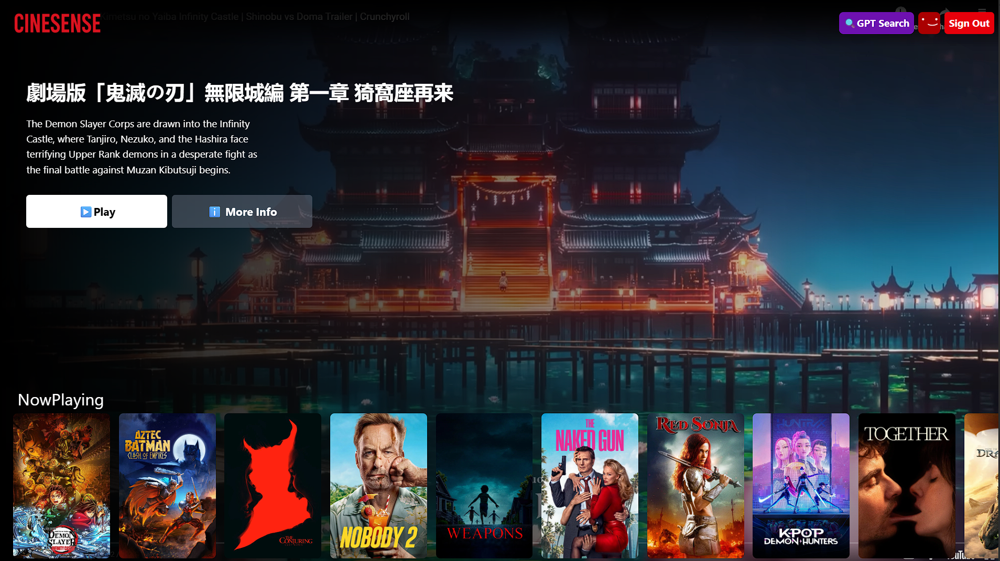

# 🎬 CineSense — Netflix-style React + Firebase app with GPT-powered search

A modern, responsive movie discovery app built with **React (Vite)**, **Firebase Auth**, **Redux Toolkit**, **Tailwind CSS**, and the **TMDB API** — plus a **GPT-powered search** experience for smart, natural-language recommendations.

**🌐 Live Demo:** https://cinesense-gpt.netlify.app/

<p align="center">
  
</p>

---

## 🌟 Highlights

- 🔐 **Auth**: Firebase email/password Sign up / Sign in / Sign out
- 🏠 **Browse**: Curated rows — _Now Playing_, _Popular_, _Top Rated_, _Upcoming_
- ▶️ **Hero Trailer**: Autoplaying, muted YouTube trailer with title & description overlay
- 🔎 **NetflixGPT**: Dedicated page with GPT prompt bar → TMDB lookups → movie suggestions
- 🌍 **i18n (Bonus)**: Multi-language support for the search experience
- 📱 **Responsive UI**: Tailwind utility classes for a clean, adaptive layout
- ⚡ **Performance**: Vite dev server, memoization, and custom hooks

---

## 🧱 Tech Stack

- **Frontend**: React 18, Vite, React Router
- **State**: Redux Toolkit (`userSlice`, `movieSlice`, `gptSlice`)
- **UI**: Tailwind CSS
- **Auth/Hosting**: Firebase
- **APIs**: TMDB (movies), OpenAI (GPT)
- **Video**: YouTube iFrame embeds

---

## 🚀 Getting Started

### 1) Clone & Install

```bash
git clone https://github.com/<your-username>/cinesense.git
cd cinesense
npm install
```

### 2) Environment Variables

Create a **`.env.local`** at the project root (Vite exposes vars prefixed with `VITE_`):

```bash

# TMDB
VITE_TMDB_ACCESS_TOKEN=your_tmdb_v4_access_token

# OpenAI (GPT)
VITE_OPENAI_API_KEY=your_openai_key
```

### 3) Firebase Setup (Auth)

1. Create a Firebase project.
2. Enable **Email/Password** in **Authentication → Sign-in method**.
3. Copy SDK values into `.env.local` (see above).

### 4) TMDB Setup

1. Create a TMDB account → **Settings → API**.
2. Generate a **Read Access Token (v4)**.
3. Put it in `VITE_TMDB_ACCESS_TOKEN`.

### 5) OpenAI Setup

1. Create an API key at OpenAI.
2. Add `VITE_OPENAI_API_KEY` to `.env.local`.

### 6) Run Dev Server

```bash
npm run dev
```

### 7) Build & Preview

```bash
npm run build
npm run preview
```

---

## 🧠 How NetflixGPT Works

1. **User prompt** in `GptSearchBar` (e.g., _“lighthearted space comedies”_).
2. **OpenAI call** transforms the prompt into **candidate movie titles / descriptors**.
3. **TMDB fetch**: For each candidate, query TMDB Search/Discover endpoints.
4. **Redux**: Results stored in `gptSlice` as `movieNames` + `movieResults`.
5. **UI**: `GptMovieSuggestions` reuses `MovieList` to render rows of suggested titles.

---

## ✅ Implemented Checklist (From Build Log)

- Configured Vite
- Installed Tailwind CSS
- Header
- Routing of App
- Login Form
- Signup Form
- Form validations
- `useRef` Hook
- Firebase Setup
- Deploying app to production
- Create Sign Up user account in Firebase
- Implement Sign In user API
- Created Redux store with `userSlice`
- Implemented Sign out
- Update profile API
- Fetch from TMDB movies
- Bugfix: Sign up user displayName & profile photo update
- Bugfix: redirect guard — if user not logged in, redirect `/browse` → Login (and vice-versa)
- Unsubscribe from `onAuthStateChanged()`
- Add hardcoded constants
- Register TMDB API & app; get access token
- Get data from TMDB **Now Playing** API
- Custom hook for now playing movies
- Create `movieSlice`
- Update store with movies data
- Plan `MainContainer` and `SecondaryContainer`
- Fetch trailer video
- Update store with trailer video
- Embed YouTube trailer (autoplay + mute)
- Tailwind styling for MainContainer
- Build `Secondary` component
- Build `MovieList`
- Build `MovieCard`
- TMDB Image CDN URL
- Browse page styling polish with Tailwind
- Custom hooks: `usePopularMovies`, `useTopRatedMovies`, `useUpcomingMovies`
- **GPT Search** feature with page + search bar
- (BONUS) Multi-language feature
- Integrate GPT APIs using API keys
- GPT Search API call
- Fetch `gptMovieSuggestions` from TMDB
- Create `gptSlice` and add data to store
- Reuse `MovieList` for GPT suggestion container
- Memoization where useful
- Create and add `.env` file (ignored)
- Responsive design with Tailwind

---

## 🛠️ Scripts

```json
{
  "dev": "vite",
  "build": "vite build",
  "preview": "vite preview",
  "lint": "eslint ."
}
```

---

## 🧭 Routing

- `/` → Login / Signup
- `/browse` → Auth-protected Browse page (hero + genre rows)
- `/gpt-search` → GPT search experience

---

## 🌐 Deployment

- Hosted on **Netlify**: https://cinesense-gpt.netlify.app/
- Typical command pair:
  ```bash
  npm run build
  ```

---
